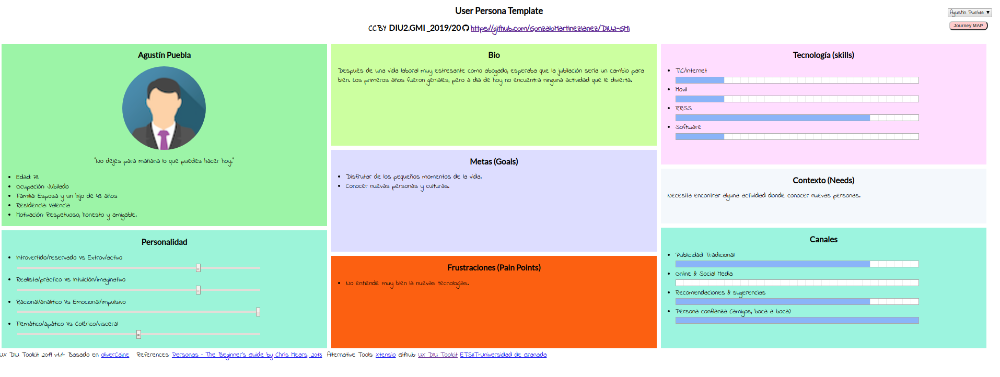
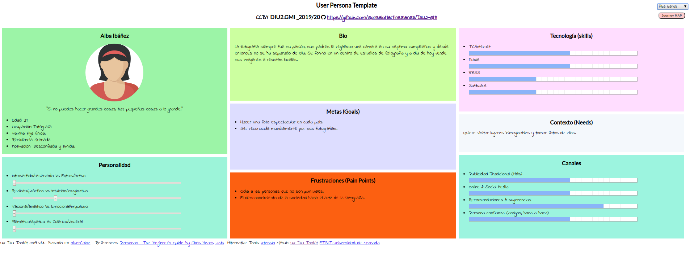
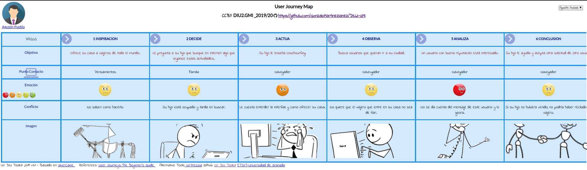
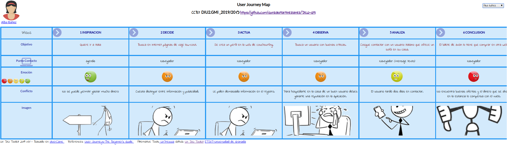
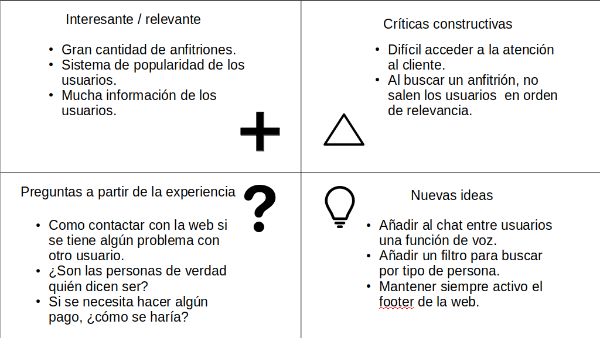
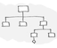
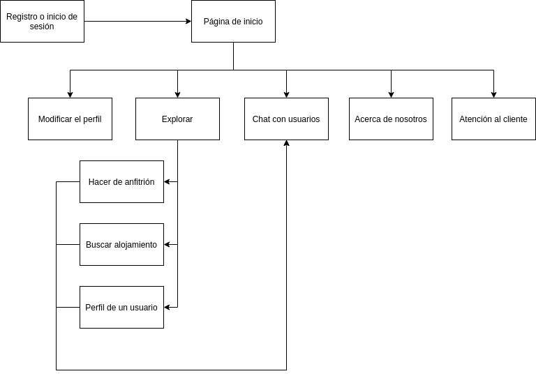
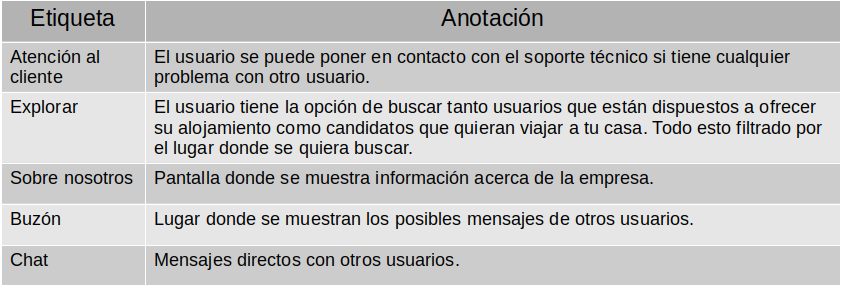
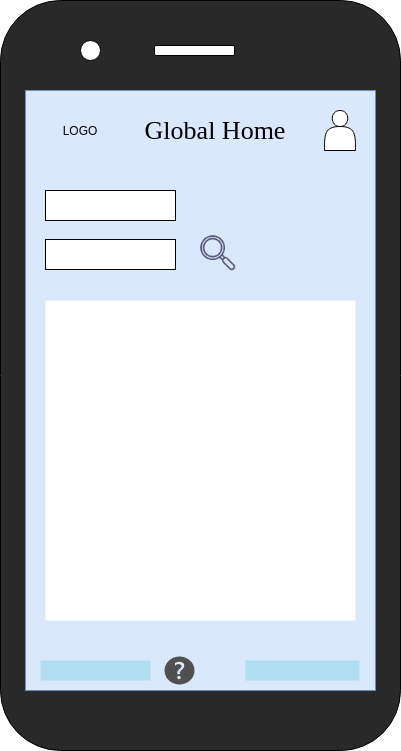
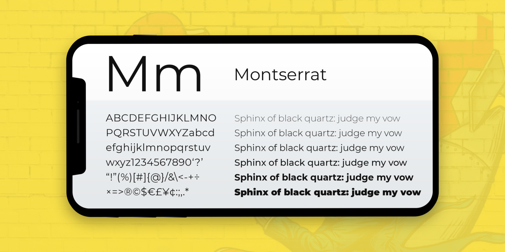

# DIU20
Prácticas Diseño Interfaces de Usuario 2019-20 (Economía Colaborativa) 

Grupo: DIU2.GMI.  Curso: 2019/20 

Proyecto: Global Home

Descripción: La nueva aplicación tiene un propósito muy similar al de couchsurfing, donde personas de distintas
partes del mundo podrán o bien buscar un anfitrión donde alojarse o ofrecer su casa a otro usuario.
La mayor diferencia con couchsurfing es que el objetivo no es de ocio sino académico donde las personas
buscan otro alojamiento por trabajo o estudios.

Logotipo: 

Miembro:
 * :bust_in_silhouette:   Gonzalo Martínez Iáñez     :octocat:     

----- 

En esta práctica estudiaremos un caso de plataforma de economía colaborativa y realizaremos una propuesta para su diseño Web/movil. Utilizaremos herramientas y entregables descritos en el siguiente CheckList (https://github.com/mgea/UX-DIU-Checklist) 

Qué es economia colaborativa: Martínez-Polo, J. (2019). **El fenómeno del consumo colaborativo: del intercambio de bienes y servicios a la economía de las plataformas**, *Sphera Publica, 1*(19), 24-46. http://sphera.ucam.edu/index.php/sphera-01/article/view/363/14141434

>>> Este documento es el esqueleto del report final de la práctica. Aparte de subir cada entrega a PRADO, se debe actualizar y dar formato de informe final a este documento online. 

# Proceso de Diseño 

## Paso 1. UX Desk Research & Analisis 

 1.a Competitive Analysis
-----

Tras analizar tres webs de economía colaborativa he llegado a estas conclusiones:

Badi: el objetivo de esta práctica es encontrar una web de economía colaborativa, pero esta web
solo tiene la opción de encontrar u ofrecer una habitación por un precio. El resto de la web parece
tener una buena organización y fácil de utilizar.
Couchsurfing: he elegido esta web ya que tiene como misión que la gente conozca personas de su
propia ciudad y de otras partes del mundo de una manera asequible. La propia aplicación web es
muy intuitiva y fácil de utiliza.
Compartetupiso: tiene una finalidad muy similar a couchsurfing, pero no la he escogido ya que esta
no tiene ese aspecto de red social que tiene couchsurfing. El diseño es minimalista y acertado.

 1.b Persona
-----

He creado a Agustín Puebla porque podría ser un candidato a usar couchsurfing y además puede poner a
prueba el diseño de esta aplicación.

Alba Ibáñez cumple un papel como alguien más común que usaría esta web, no obstante no es
experta en tecnología y podría tener algún problema.

 1.c User Journey Map
----
Con este primer mapa, muestro como un usuario ofrece su casa a otro. La situación puede ser un
poco forzada pero posible.

En este mapa ocurre lo contrario, la usuario quiere viajar. En este caso el problema reside
mayormente en factores externos a la web.

 1.d Usability Review
----

Revisión de usabilidad: https://github.com/GonzaloMartinezIanez/DIU2-GMI/tree/master/P1/Couchsurfing.pdf

## Paso 2. UX Design  

 2.a Feedback Capture Grid
----

La nueva aplicación tiene un propósito muy similar al de couchsurfing, donde personas de distintas
partes del mundo podrán o bien buscar un anfitrión donde alojarse o ofrecer su casa a otro usuario.
La mayor diferencia con couchsurfing es que el objetivo no es de ocio sino que las personas deben
buscar otro alojamiento por trabajo o estudios.

La aplicación dejará a los usuarios la tarea de realizar un pago si es que estos acuerdan un precio.
No obstante, se fomentará el uso de otras formas de pago no monetarias.

 2.b Tasks & Sitemap 
-----

 2.c Labelling 
----

 2.d Wireframes
-----

Los bocetos se encuentran en la memoria de la práctica 2: https://github.com/GonzaloMartinezIanez/DIU2-GMI/tree/master/P2/MemoriaP2.pdf

## Paso 3. Mi equipo UX-Case Study 

 3.a ¿Como se cuenta un UX-Case Study?
-----
En el ejemplo propuesto de MuseMap empiezan explicando al lector el objetivo de la aplicación que se va a desarrollar. Después se determinan las funcionalidades que tendrá como el público al que está enfocado, añadiendo un experimento realista de las experiencia que tendría el usuario final usando la aplicación. Para tener una visión más acertada realizan entrevistas a unos candidatos para comprender sus interes en esta aplicación.

Al igual que lo desarrollado en la práctica dos, crean dos personas ficticias para que simulen la intereacción con la aplicación y encontrar los fallos. Para ello hacen mapas de experiencia.

Con la idea general en mente empiezan a hacer bocetos generales, analizandolos hasta llegar a uno definitivo. Ahora solo falta elegir el estilo que tendrá la aplicación en cueanto a tipografía, color e iconos.

Si el resultado de este estudio es satisfactorio se empezará con el desarrollo de la aplicación. De lo contrario se puede volver a empezar de cero teniendo en cuenta los problemas de este primer diseño.

  3.b Logotipo
----
No se ha diseñado ningún logotipo, pero la idea es que sea elegante, minimalista y con los colores característicos de esta aplicación (Descritos en el apartado 3c).

 3.c Guidelines
----
Los colores elegidos para la aplicación son tonos de azules claros:

La tipografía escogida es legible para que ningún usuario tenga algún problema además de formal:

  3.d Video
----
https://github.com/GonzaloMartinezIanez/DIU2-GMI/tree/master/P3/video.mkv

## Paso 4. UX Check (Usability Testing) 

 4.a A/B Testing
----

>>> Comprobacion de asignaciones para A/B Testing. Asignaciones https://github.com/mgea/DIU19/blob/master/ABtesting.md

>>>> Práctica A: 

 4.b User Testing
----

>>> Usuarios para evaluar prácticas 

| Usuarios | Sexo/Edad     | Ocupación   |  Exp.TIC    | Personalidad | Plataforma | TestA/B
| ------------- | -------- | ----------- | ----------- | -----------  | ---------- | ----
| User1's name  | H / 18   | Estudiante  | Media       | Introvertido | Web.       | A 
| User2's name  | H / 18   | Estudiante  | Media       | Timido       | Web        | A 
| User3's name  | M / 35   | Abogado     | Baja        | Emocional    | móvil      | B 
| User4's name  | H / 18   | Estudiante  | Media       | Racional     | Web        | B 

. 4.c Cuestionario SUS
----

>>> Usaremos el **Cuestionario SUS** para valorar la satisfacción de cada usuario con el diseño (A/B) realizado. Para ello usamos la [hoja de cálculo](https://github.com/mgea/DIU19/blob/master/Cuestionario%20SUS%20DIU.xlsx) para calcular resultados sigiendo las pautas para usar la escala SUS e interpretar los resultados
http://usabilitygeek.com/how-to-use-the-system-usability-scale-sus-to-evaluate-the-usability-of-your-website/)
Para más información, consultar aquí sobre la [metodología SUS](https://cui.unige.ch/isi/icle-wiki/_media/ipm:test-suschapt.pdf)

>>> Adjuntar captura de imagen con los resultados + Valoración personal 

 4.c Usability Report
----

>> Añadir report de usabilidad para práctica B 

## Paso 5. Evaluación de Accesibilidad  

  5.a Accesibility evaluation Report
----

>>> Indica qué pretendes evaluar (de accesibilidad) y qué resultados has obtenido + Valoración personal

>>> Evaluación de la Accesibilidad (con simuladores o verificación de WACG) 

## Conclusión / Valoración de las prácticas

>>> (90-150 caracteres) Opinión del proceso de desarrollo de diseño siguiendo metodología UX y valoración (positiva /negativa) de los resultados obtenidos  

